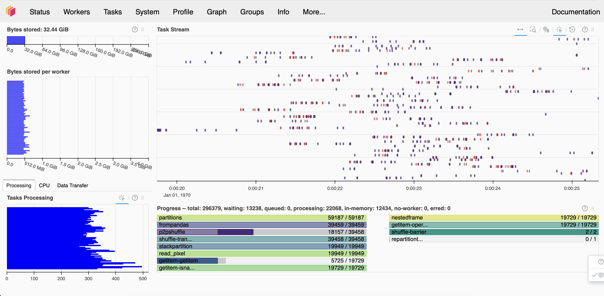

# 1. DP2 Epoch Propagation at Scale: Reproducing and Quantifying DP1→DP2 Gaia Differences

Port DP1 vs Gaia DR3 epoch propagation notebook to DP2. Part of the notebook includes large crossmatch. Write the results down to disk - do not cross the threshold of 5 Gb of data (This is because we are only working with ⅙ of the data, and we want to make sure this is feasible with the full DP2 dataset). If needed, reduce the number of columns, and consider how to reduce the number of crossmatches without comprising scientific result. Compare your result to the result in the DP1 vs GAIA DR3 notebook. Answer by how much is the effect due to epoch propagation larger in DP2 than it was for DP1. To do this compare median values for DP1 and DP2 (median measure of the values shown in Section 9 in the documentation notebook).

## Definition of done:

- Crossmatch output exists as HATS catalog.
- Final saved HATS catalog is <= 5 GB.
- There is a quantitative result for the change between DP1 and DP2 result

## Notes

### Set up the environment

- Started a large 16GiB instance on https://usdf-rsp.slac.stanford.edu.
- Copied the DP1 epoch propagation notebook from our LSDB repo into the machine.
- Ran `%pip install lsdb hats -–upgrade`. The new lsdb/hats version is v0.8.2.
- Changed descriptions to reference DP1->DP2.
- We do not yet have a link for `lsdb.io/dp2`, but I changed it anyway.

### 0. Import packages

- "AttributeError: module 'numpy' has no attribute 'in1d'"
- `astropy` needed to be upgraded (`v7.2.0` works)

### 1. Define epochs

- Visited https://rubinobservatory.org/for-scientists/resources/early-science to confirm the period for which DP2 data was captured.
- Seems to have been April 17 - September 21, 2025. But most of the data was captured after June 20.
- August 1st is day 213 of the year. 213 / 365 ~ 0.581
- Let’s say we have J2025.6 for DP2.

### 2. Open catalogs

- Changed the path to the DP2 object collection.

### 3. Derive proper-motion filter

- At first I did not understand where the 1000 was coming from.
- The answer is that Gaia proper motions are in mas/year and not arcsec/year (see [Gaia DR3 column descriptions](https://irsa.ipac.caltech.edu/data/Gaia/dr3/gaia_dr3_source_colDescriptions.html)).
- Added a small sentence to explain that.

### 4. Load Gaia DR3 subset

- "ImportError: Install s3fs to access S3"
- `%pip install s3fs` resolved it

### 5. Define epoch propagation

- I did not know what the "byear" format was. It’s [Besselian year](https://docs.astropy.org/en/stable/api/astropy.time.TimeBesselianEpoch.html#astropy.time.TimeBesselianEpoch).

- Added the following "caveat" note for the users:

  > **Important**: Notice how we do not update the catalog ra/dec columns in place. That is an illegal action that would break the structure of the HATS catalog (e.g. \_healpix_29), as well as margins, which are needed in the next step of crossmatch! To prevent this from happening we create new columns, "ra_corr" and "dec_corr", to store the propagated positions.

### 6. Crossmatch propagated Gaia with DP2

- The crossmatch has 19,279 partitions (the one for DP1 had 389).
- Tried saving a single xmatch partition and I ran out of memory almost instantly!
- **Big painpoint:** Seems to be the problem where selecting `xmatch.partitions[]` by index will not prune the task graph.
- Sean created a branch replacing `to_delayed` with `dd.map_partitions`, and now the previous pruning works with a distributed Client!
- I am now able to save the full "propagated" crossmatch with just the coordinate columns.
  - Added filter to remove objects with no matches.
  - Configuration: `n_workers=8, n_neighbors=20`.
  - Size of HATS catalog on disk: `~3GiB` (as required in project goals).
  - Runtime: `~30 min`.

### 6.1. Warnings

In this step I stumbled upon these warnings:

#### Warning 1

> /opt/lsst/software/stack/conda/envs/lsst-scipipe-10.1.0-exact/lib/python3.12/site-packages/fsspec/caching.py:692: UserWarning: Read is outside the known file parts: (267436792, 268404993). IO/caching performance may be poor!

I do not know the cause. Seems to be related to S3 remote reads.

#### Warning 2

> /opt/lsst/software/stack/conda/envs/lsst-scipipe-10.1.0-exact/lib/python3.12/site-packages/erfa/core.py:133: ErfaWarning: ERFA function "pmsafe" yielded 15 of "distance overridden (Note 6)"

Known issue reported on astropy ([#11747](https://github.com/astropy/astropy/issues/11747)).

#### Warning 3

> distributed.core INFO: Event loop was unresponsive in Nanny for 3.44s. This is often caused by long-running GIL-holding functions or moving large chunks of data. This can cause timeouts and instability.

Happens when the Client is being setup. Maybe due to the fact that there are still >19k partitions and graph is large.

### 7. Baseline: crossmatch without propagation

- Added filter to remove objects with no matches.

### 8. Compute results with a local Dask client

- Computing the distances for the propagated crossmatch was fast!

- Trying to get the "naive matches" ... but I run out of space on the device:

  > 2026-03-16 19:07:47,100 - distributed.shuffle.\_disk - ERROR - P2P ran out of available disk space while temporarily storing transferred data. Please make sure that P2P has enough disk space available by increasing the number of workers or the size of the attached disk. ... OSError: [Errno 28] No space left on device

    
    
  - There are some tasks here that I had never seen before (e.g. `p2pshuffle`, that runs a lot at the end).
  - By default Dask is using `/tmp` but it only has 4GiB of space available.
  - Tried setting `Client(..., local_directory="")` offshore, but it is not reachable.

- Finished computation on a larger machine @ USDF.

### 9. Plot separation distribution

- Nice results, we once again get a larger number of matches and a tighter distribution in the propagated crossmatch.
- The median of the propagated xmatch distances is ~7.5x smaller.

## Other action items

- Create an issue on LSDB to add an example of `filters=` to the docs.
- Create an issue on LSDB to prevent users to change ra/dec in user defined functions wrapped by map_partitions, map_rows, etc.
