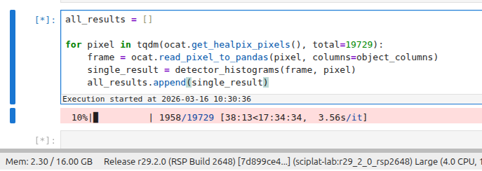

# 3. Focal-Plane Systematics Check: Edge vs Center Detector Flux-Residual Performance in DP2 

Compute mean fluxes over forced sources and compute relative difference from object flux using: (mean_source_flux - object_flux) / sqrt(mean_source_fluxerr^2 + object_fluxerr). Remove any measurement with any kind of flag. Include every lightcurve per band with more than 10 observations per band, after filtering for flags.
Plot:
- histogram of this value
- mean and std over detectors.

Based on this information, is the performance of the pipelines better for central detectors than for those on the edge of the focal plane (Find on your own which detectors are where - Rubin Observatory will provide this information publicly <UNCLE VAL Script>). Define a reasonable definition of what ``better performance`` means.

## Definition of done:
- Formula implemented correctly with uncertainty propagation, and every lightcurve in the dataset evaluated
- Both required plots present.
- Center vs edge conclusion linked to your performance criterion.


## Lab Notes

### Friday, Mar 6

Finally got my RSP up to v0.8.2

### Monday, Mar 9

**Lightcurving discussion** 

**note** should we create a feature request against nested, to allow for an enumeration of possible values in `count_nested`? 
e.g. i want all of ['u', 'g', 'r', 'i', 'z', 'y'], but some areas of the sky will only have *ugri*, and will have different columns
from other parts of the sky.
Similarly, i might only be interested in *gri* (but could filter out all detections not in those bands before performing `count_nested`).

```
for band in 'ugrizy':
  nf[f"lc_{band}"] = nf.query(f"nested.band=='{band}'")["nested]
  nf = count_nested(nf, f"lc_{band}", by="band", join=True)
```

### Tuesday

Nothing interesting

### Wednesday

It would be nice to have the `write_catalog` call take a list of columns to write. i guess i could drop them myself, but 
it would just be nice.

Created https://github.com/lincc-frameworks/nested-pandas/issues/472

Would it be ok to have a per-detection "anyFlag" kind of value, to make filtering easier?

**Notebook 1:**

Plan of attack:

* Find appropriate objects
  * Only read the fields I actually want. 
    * Still figuring out exactly which fields those are.
    * Have a list of fluxes, forced source fluxes, flags, detector
  * Find appropriate light curves
    * Remove any measurement with any flag
      * ok - have a nice strong filter string i can query with
    * get per-band light-curve lengths
    * remove any single-band lightcurve with fewer than 10 observations
  * remove objects with no single-band lightcurves
* Clean up the columns I don't need anymore
* I think at this point I can write out my lightcurves

**Cone**

* Running on a little cone in a DDF. Overlaps 4 tiles.
* For the 16k objects, all are retained in filtering.
* Resulting intermediate catalog is 68M
* Looking at 550GB for the 148811412 objects (assuming ~90% meet filters)
* So this strategy might not work.
* But that estimate feels like nonsense. The whole catalog is only 726 GB.
* Still going to be larger than 5G.

### Thursday

Let's still use the lightcurves from the above cone to try out stuff for the science numbers.

**Notebook 2:**

You know what? Let's start small. I'm going to just try to plot the count of detections per-detector first. 

> Find on your own which detectors are where - Rubin Observatory will provide this information publicly

I have to do quite a bit of fudging around to get the detector layout plot, but hot-damn I did it.

### Friday

**Notebook 4:**

I want to combine 01, 02, and 03, and find the full sky-version of the per-detector detection count plots.

It's running, and it's beeing going for 8 minutes. Wish I were using 

1. an explicit client or 
2. the branch of lsdb that has a progress bar.

But now I kind of want to just let it go and see how long it will take, 
if you don't know what you're doing (which I don't!).

25 minutes in, and, hey, the memory is staying well under the limit! 3.3 / 16.0 GB 
But that probably means this is just using one worker and will basically never finish.

Ok - gave up after >1 hour. Retrying with an instantiated client. Has 4 workers, and limit of 6GB, but is using < 5 GB.

15 minutes in and now we've got unmanaged memory warnings! Yay!

And then something just pooped. But I have a dashboard I can look at when I run again:

https://usdf-rsp.slac.stanford.edu/nb/user/delucchi/proxy/8787/status

So I think this will take ... 3 hours? If it actually finishes?

**Notebook 10:**

> Compute mean fluxes over forced sources and compute relative difference from object flux using: (mean_source_flux - object_flux) / sqrt(mean_source_fluxerr^2 + object_fluxerr). 
> Plot:
> - histogram of this value
> - mean and std over detectors.
> 
> Based on this information, is the performance of the pipelines better for central detectors than for those on the edge of the focal plane . Define a reasonable definition of what ``better performance`` means.


Plan of attack:

* Let's try this out using my cone catalog, and see what some reasonable values are for the histogram bins before
  running over the whole sky.
* Then I think I want to return, per pixel
  * nested, per (band, detector)
    * band
    * detector
    * number of values
    * sum of value
    * sum of squares of value
    * histogram of values
* and i think i want to just `to_hats` this, and not hold the whole thing in memory just yet.

### Monday

New week, new frustrations.

I tried modifying notebook 4 to just use a catalog stream, and it runs out of memory after a few iterations.

So for **Notebook 5**, I'm just using HATS. No lsdb, no dask, just one thread of work going. 



So far, it's actually running, not using a ton of memory, and might actually complete before the homework is due. I know that this isn't the full result I'm supposed to get to, but I want to get SOMETHING that completes.

This is also using few-enough resources that I can iterate on the meatier parts in a different notebook in the same jupyter instance.

## Summary of feedback

There were a handful of pain points I experienced.

* Added feedback to https://github.com/lincc-frameworks/nested-pandas/issues/470 (`split(by=)` feature request)
* Opened https://github.com/lincc-frameworks/nested-pandas/issues/472 (silly little `count_nested` behavior)
* I might still want `count_nested` to take the enumeration of values that I want.
* It would be nice to have the `write_catalog` call take a list of columns to write. 
  I guess I could drop them myself, but it would just be nice.
* In DASH, would it be ok to create a per-detection "anyFlag" kind of value, to make filtering easier?
* It was kind of a pain to get the detector plot. Would any one else want to re-use it?
  Could add to `lsdb-rubin` package.
* would like to have a `hats.show_versions()` method, too